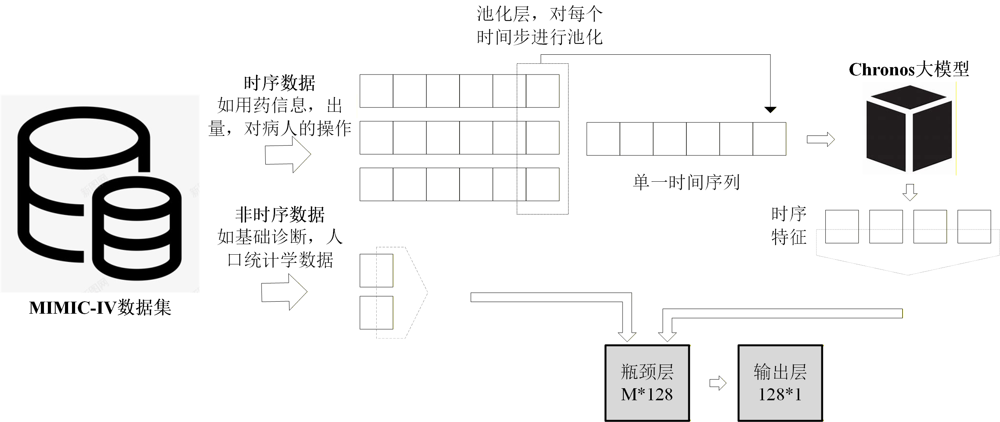
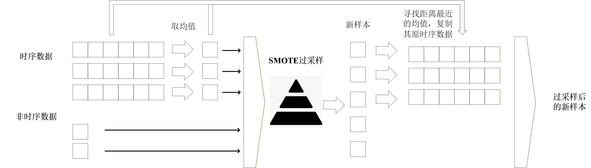

# **🕰️ 基于 Chronos 基础模型的医疗时序数据分类研究**

## 1\. 项目简介

本次实验旨在探索**大规模时序基础模型 Chronos** 在医疗领域多模态数据分类任务中的应用潜力。我们成功地将原用于单变量时间序列预测的 Chronos 模型进行迁移和适应性改造，使其能够处理 MIMIC-IV 多模态数据集（时序+非时序数据），并应用于**患者死亡风险**和**住院时长预测**两项关键的二分类任务。

项目的核心工作在于：

1.  **时序数据编码：** 利用 Chronos 的 Transformer 编码器部分，提取复杂的时序特征。
2.  **多模态融合：** 设计并实现了模型架构，将 Chronos 提取的时序特征与非时序特征进行融合与降维。
3.  **数据不平衡处理：** 针对医疗数据中严重的类别不平衡问题，创新性地提出了**改进版的 SMOTE 过采样策略**，确保了生成新样本的时序结构合理性和数据间的内在关联。

## 2\. 项目特色

### **核心创新点**

  * **Chronos 编码器迁移与特征融合：**

      * 仅利用Chronos强大的 **Encoder** 部分作为时序特征提取器。
      * **模型架构图**  
         
      * 通过池化层对原始多维时序数据进行降维后输入 Chronos 编码，提取出的时序特征与非时序特征在瓶颈层进行融合，实现多模态信息的有效利用。

  * **改进型 SMOTE 时序数据增强：**

      * 针对 SMOTE 算法不适用于时序数据的缺陷，设计了三步走的改进流程：**时序平均 → 标准 SMOTE → 时序重构**。
      * **改进后的SMOTE方法示意图**  
         
      * 通过将合成的低维特征反向映射到最接近的真实样本时序结构，确保了在解决类别不平衡问题的同时，生成的时序数据依然保持了其内在的连贯性和真实性。

### **Chronos 技术简析**

  * Chronos 的基础在于将连续时间序列通过**均值缩放**和**均匀区间划分**离散化为类语言的 Token 序列。这使得它可以复用 Transformer/T5 的架构和“下一个 Token 预测”的训练范式。
  * 通过将预测问题转化为**交叉熵损失**的分类问题，它极大地增强了模型跨任务、跨领域预测的**泛化能力**。此外，原模型还采用了 **TSMix** 和 **KernelSynth** 两种数据增强策略来克服高质量时序数据稀缺的问题。

## 3\. 项目效果

项目的详细实验结果和性能分析请直接参见 `docs/实验报告.docx`。

## 4\. 系统架构

| 目录/文件名 | 功能描述 |
| :--- | :--- |
| `docs/` | **实验文档与报告**：存放所有实验报告、详细结果分析和图表等文档资料。 |
| `src/patient_data/data.pt` | **数据集**：存放经过处理的 MIMIC-IV 数据集。 |
| `src/saved/classifier_labels_los.pt` | **预测标签（住院时长）**：存放在“住院时长预测”上经过训练的模型。 |
| `src/saved/classifier_labels_mor.pt` | **预测标签（死亡风险）**：存放在“患者死亡风险预测”上经过训练的模型。 |
| `src/main.py` | **主执行文件**：项目的核心入口，负责调用数据加载、实现改进型 SMOTE 逻辑、定义 Chronos 分类模型架构、以及进行训练、验证和评估的全流程。 |


## 5\. 使用说明

此项目已提供完整的代码和预训练模型，您可以直接使用：

1.  下载完整的代码包。
2.  确保所有必要的依赖库已安装，**可稳定运行的版本：**  

| 库名 | numpy | torch | sklearn | matplotlib | pandas | seaborn | imblearn | chronos |
| :--- | :--- | :--- | :--- | :--- | :--- | :--- | :--- | :--- |
| 版本 | 2.0.2 | 2.5.1+cu121 | 1.6.0 | 3.10.8 | 2.3.3 | 0.13.2 | 0.14.0 | 2.2.0 |

3.  直接运行主要的训练和预测脚本：
    ```bash
    python main.py
    ```
4.  代码中的模型已经训练完毕，运行后可以直接在测试集上进行评估，或者通过修改配置文件来进行新的训练和实验。


## 项目来源
本项目是南京信息工程大学《智慧医疗综合实践》课程的综合实践  
原实验为小组作业，本项目仅给出了个人完成的部分  
Chronos原论文：[Chronos: Learning the Language of Time Series](https://arxiv.org/abs/2403.07815)
